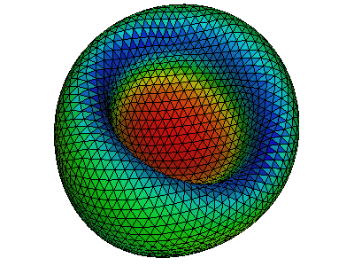
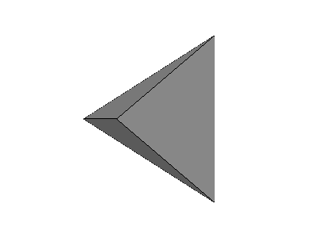
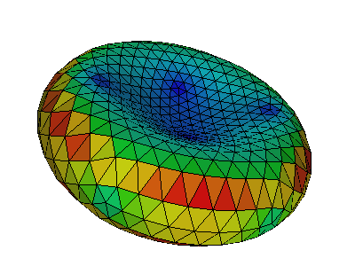
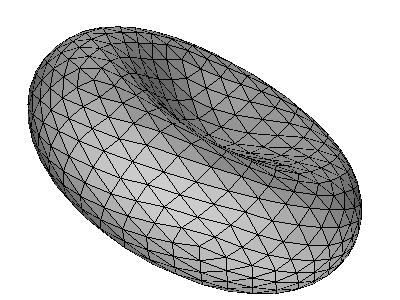

<H1>Corpuscles</H1>
<H2>Introduction</H2>
Corpuscles is a C library to resolve the elastic energy and force of a
membrane surface, which is represented by an unstructured triangulated
mesh.  It also simulates transformations between different
configurations/shapes of a closed membrane by a minimization procedure
under various constraints.

Various components can be switched on/off at will, such as 
<ol>
<li>Bending elasticity of lipip bilayer</li>
<li>Strain (both shear and strecth) elasticity of cytoskeleton</li>
<li>Viscosity of lipid membrane</li>
<li>Thermal fluctuations of lipid membrane</li>
<li>Constraint of reduced volume of a closed membrane surface</li>
<li>Constraint of total area of a closed membrane surface</li>
<li>Constratin of total volume of a closed membrane surface</li>
<li>Constratin of area difference between outer- and inner-surface</li>
</ol>

For different components, variations of model/law can be selected such
as Helfrich/spontaneous curvature model for bending elasticity and
Skalak law for strain elasticity.

For different models/laws, variations of schemes impelemented can also
be choosen such as Gompper and Kroll scheme and Juelicher scheme for
the bending model of spontaneous curvature. See more details in
[https://cselab.github.io/corpuscles](https://cselab.github.io/corpuscles)

<H2>Install</H2>
Minimal dependencies are C and Fortran 90 compilers,
<a href="https://www.gnu.org/software/gsl">GNU Scientific Library</a>,
and
<a href="https://www.freedesktop.org/wiki/Software/pkg-config">pkg-config</a>.

Optional dependencies
<a href="http://geomview.org">geomview</a>,
<a href="https://maxima.sourceforge.io">maxima</a>,
and
<a href="https://pandoc.org">pandoc</a>.

Adjust <a href="https://github.com/cselab/corpuscles/blob/master/conf.mk">conf.mk</a> if you want to change defaults

<pre>
$ cat conf.mk
CC = gcc
FC = gfortran

FCFLAGS = -O2 -g
FXFLAGS = -fallow-argument-mismatch

GSL_CFLAGS = " `gsl-config --cflags `"
GSL_LDFLAGS = " `gsl-config --libs `"

CFLAGS = -O2 -g
LDFLAGS =
PREFIX = $(HOME)/.local
DATAPATH = $(HOME)/.co
MAXIMA_HOME = $(HOME)/.maxima

# prefix for commands
P = co
</pre>

<tt>PREFIX/bin</tt> should be on the path, for example

<pre>
$ cat $HOME/.bashrc
PATH="$HOME/.local/bin:$PATH"
</pre>

Library is installed under the path <tt>PREFIX</tt>. Run
<pre>
$ MAKEFLAGS=-j4 ./install.sh
</pre>

If you have
<a href=https://github.io/slitvinov/atest>atest</a>
you can run
<pre>
$ make test
</pre>

You can also use a <a href="https://github.com/cselab/corpuscles/blob/master/Dockerfile">docker containter</a>.

<H2>Examples</H2>

<H3>Hello world</H3>

A program in [example/hello](https://github.com/cselab/corpuscles/blob/master/example/hello/) computes area of a triangle.

<pre>
$ cat main.c
#include &lt;stdio.h&gt;

#include &lt;real.h&gt;
#include &lt;co/tri.h&gt;

#define FMT CO_REAL_OUT

int
main(void)
{
    real A, a[] = { 0, 0, 0 }, b[] = { 2, 0, 0 }, c[] = { 0, 1, 0 };
    A = tri_area(a, b, c);
    printf("Area is of triangle: " FMT "\n", A);
}

</pre>

<pre>
$ cat Makefile
include ../../conf.mk
PREC = d
main: main.c
	$(CC) main.c $(CFLAGS)  `co.conf --cflags --libs $(PREC) ` $(LDFLAGS) -o $@
clean:; rm -f main

</pre>

<H3>Read mesh file</H3>

Corpuscles reads
<a href="https://en.wikipedia.org/wiki/OFF_(file_format)">OFF files</a>.
Here is <a href="https://github.com/cselab/corpuscles/blob/master/data/regular/tetra.off">a file with triangular pyramid</a>.

This program reads an OFF file from an input stream:

<pre>
$ cat main.c
#include &lt;stdio.h&gt;

#include &lt;real.h&gt;
#include &lt;co/array.h&gt;
#include &lt;co/he.h&gt;
#include &lt;co/y.h&gt;

int
main(void)
{
    real *x, *y, *z, hi;
    He *he;
    int nv, nt;

    y_inif(stdin, &he, &x, &y, &z);
    nv = he_nv(he);
    nt = he_nt(he);
    hi = array_max(nv, x);
    printf("number of vertices is %d\n"
           "number of triangles is %d\n"
           "maximum x coordinate is " CO_REAL_OUT "\n", nv, nt, hi);
    y_fin(he, x, y, z);
}

</pre>

<pre>
$ make
$ ./main < `co.path`/regular/tetra.off
number of vertices is 4
number of triangles is 4
maximum x coordinate is 1

</pre>

<H3>Write mesh file</H3>

Read off, compute area of every triangle, and output off file with
colors ([example/off/write/area](https://github.com/cselab/corpuscles/blob/master/example/off/write/area/))

<pre>
$ cat main.c
#include &lt;stdio.h&gt;

#include &lt;real.h&gt;
#include &lt;co/area.h&gt;
#include &lt;co/err.h&gt;
#include &lt;co/off.h&gt;
#include &lt;co/he.h&gt;
#include &lt;co/memory.h&gt;
#include &lt;co/y.h&gt;

int main(void) {
    int nt;
    real *x, *y, *z, *a;
    He *he;
    y_inif(stdin, &he, &x, &y, &z);
    nt = he_nt(he);
    CALLOC(nt, &a);
    he_area_tri(he, x, y, z, a);
    boff_tri_fwrite(he, x, y, z, a, stdout);
    y_fin(he, x, y, z);
    FREE(a);
}

</pre>

<pre>
$ ./main < $(co.path)/rbc/laplace/0.off > out.off
</pre>

To see the results

<pre>
$ co.geomview -r 55.9195 -13.672 8.69021 -f 25.0389 out.off
</pre>

<H3>Refine mesh</H3>

Using sqrt(3)-subdivision scheme
<pre>
$ co.geomview -r 60 -40 10 -f 22 `co.path`/rbc/icosahedron/0.off
$ co.sqrt3 < `co.path`/rbc/icosahedron/0.off > a.off
$ co.geomview -r 60 -40 10 -f 22 a.off
</pre>

<H2>Visualization</H2>
We use a wrapper to
<a href="http://geomview.org">geomview</a>.

<pre>
$ co.geomview -h
co.geomview [-t x y z] [-r x y z] [-a APPEARANCE] [-o FILE] [OFF]..
he geomview wrapper
-t x y z      translation
-r x y z      rotation in degree
-f zoom       field of view (default is 40)
-a APPEARANCE load appearance from a file
-o FILE       write FILE and exit
-O            write all PPM files and exit
-OO           write all oogl files and exit
-format	ppmscreen|ppm|ps|ppmosmesa|ppmosglx
-p command    process every off file by running  'command ' &lt; IN.off &gt; OUT.off
-n none|each|all|keep normalization status (see geomview manual)
-c command    run command on every file and write output to stderr, %f is replaced by a file name
-e command    if keys  'e ' is pressed runs
               '&lt;OFF command -t x y z -r x y z -f zoom -i [index of a file] -n  [number of files]  ' or
               '&lt;OFF command ' if -e  '|command ' is passed
-i command    run command on every image, %i replaced by input; %o -- by output; %b --- by basename

Keys:
    q: quit
    s: save snap.ppm
    S: save every snapshot
    e: run command on OFF file (see -e option)
    p: panel
    j/k: switch between off files
    J: dump file name
    [SPC]: dump orientation and field of view

Environment variables:
WX, WY: resolution of the snapshot (default: 800x600)
BACKGROUND: default ( '1 1 1 ')
GEOMVIEW_ARGS: pass to geomview

Examples:
co.geomview -t 0.25 0.25 0     data/rbc.off
co.geomview -a data/appearance data/rbc.off
co.geomview -o snap.ppm        data/rbc.off
co.geomview                    data/rbc.off data/sph.off
co.geomview -p co.orient       data/rbc.off data/sph.off
co.geomview -c off.volume      data/rbc.off data/sph.off

</pre>

<H2>Library</H2>

<H3>Floating point precision</H3>

<a href="https://github.com/cselab/corpuscles/blob/master/lib/co/prec/s/real.h">prec/s/real.h</a>, <a href="https://github.com/cselab/corpuscles/blob/master/lib/co/prec/d/real.h">prec/d/real.h</a>, <a href="https://github.com/cselab/corpuscles/blob/master/lib/co/prec/l/real.h">prec/l/real.h</a>
:   single, double, long double

<H3>Math</H3>

<a href="https://github.com/cselab/corpuscles/blob/master/lib/co/vec.h">vec.h</a>, <a href="https://github.com/cselab/corpuscles/blob/master/lib/co/edg.h">edg.h</a>, <a href="https://github.com/cselab/corpuscles/blob/master/lib/co/tri.h">tri.h</a>, <a href="https://github.com/cselab/corpuscles/blob/master/lib/co/dih.h">dih.h</a>, <a href="https://github.com/cselab/corpuscles/blob/master/lib/co/ten.h">ten.h</a>
: vector, edges, triangels, dihidrals, tensors

<a href="https://github.com/cselab/corpuscles/blob/master/lib/co/dvec.h">dvec.h</a>, <a href="https://github.com/cselab/corpuscles/blob/master/lib/co/dedg.h">dedg.h</a>, <a href="https://github.com/cselab/corpuscles/blob/master/lib/co/dtri.h">dtri.h</a>, <a href="https://github.com/cselab/corpuscles/blob/master/lib/co/ddih.h">ddih.h</a>
: derivatives of vector edges, triagels, dihidrals

<a href="https://github.com/cselab/corpuscles/blob/master/lib/co/ring.h">ring.h</a>
: operation on the first ring of neighbors

<H3>Utility</H3>

<a href="https://github.com/cselab/corpuscles/blob/master/lib/co/array.h">array.h</a>
:  array related functions

<a href="https://github.com/cselab/corpuscles/blob/master/lib/co/argv.h">argv.h</a>
:  read from <tt>argv</tt> and shift

<a href="https://github.com/cselab/corpuscles/blob/master/lib/co/err.h">err.h</a>
:   error handling

<a href="https://github.com/cselab/corpuscles/blob/master/lib/co/endian.h">endian.h</a>
:   deal with endianess

<a href="https://github.com/cselab/corpuscles/blob/master/lib/co/macro.h">macro.h</a>
:   macros

<a href="https://github.com/cselab/corpuscles/blob/master/lib/co/sum.h">sum.h</a>
:   [Kahan summation](en.wikipedia.org/wiki/Kahan_summation_algorithm)

<a href="https://github.com/cselab/corpuscles/blob/master/lib/co/memory.h">memory.h</a>
:   memory related

<a href="https://github.com/cselab/corpuscles/blob/master/lib/co/util.h">util.h</a>
:   uncategorazed

<H3>Surface properties</H3>

<a href="https://github.com/cselab/corpuscles/blob/master/lib/co/area.h">area.h</a>
:   area

<a href="https://github.com/cselab/corpuscles/blob/master/lib/co/volume.h">volume.h</a>
:   volume

<a href="https://github.com/cselab/corpuscles/blob/master/lib/co/laplace.h">laplace.h</a>
:   Laplace operator of coordinates

<a href="https://github.com/cselab/corpuscles/blob/master/lib/co/normal.h">normal.h</a>
:   normal

<H3>"Forces"</H3>

<a href="https://github.com/cselab/corpuscles/blob/master/lib/co/bending.h">bending.h</a>
:   generic interface to several bending forces

<a href="https://github.com/cselab/corpuscles/blob/master/lib/co/forces.h">forces.h</a>
:   generic interface to forces

<a href="https://github.com/cselab/corpuscles/blob/master/lib/co/stretch.h">stretch.h</a>
:   stretching force

<H3>Surface transformation</H3>

<a href="https://github.com/cselab/corpuscles/blob/master/lib/co/equiangulate.h">equiangulate.h</a>
:   equlatirate triangles

<a href="https://github.com/cselab/corpuscles/blob/master/lib/co/orient.h">orient.h</a>
:   orient surface in a direction of eigen values of momentum tensor

<a href="https://github.com/cselab/corpuscles/blob/master/lib/co/restore.h">restore.h</a>
:  restore a volume of the surface

<a href="https://github.com/cselab/corpuscles/blob/master/lib/co/transformation.h">transformation.h</a>
:  translate, rotate, and and scale surface

<a href="https://github.com/cselab/corpuscles/blob/master/lib/co/remesh.h">remesh.h</a>
: "edit" surfaces

<H3>Half-edg related</H3>

<a href="https://github.com/cselab/corpuscles/blob/master/lib/co/read.h">read.h</a>
:   read half-edg to intermediate structure HeRead, used to initialize half-edg

<a href="https://github.com/cselab/corpuscles/blob/master/lib/co/he.h">he.h</a>
:   half edg data structure (provides half-edg API)

<a href="https://github.com/cselab/corpuscles/blob/master/lib/co/hash.h">hash.h</a>
:   stores an integer for a pair of integers

<H3>IO</H3>

<a href="https://github.com/cselab/corpuscles/blob/master/lib/co/gts.h">gts.h</a>,
<a href="https://github.com/cselab/corpuscles/blob/master/lib/co/obj.h">obj.h</a>,
<a href="https://github.com/cselab/corpuscles/blob/master/lib/co/off.h">off.h</a>,
<a href="https://github.com/cselab/corpuscles/blob/master/lib/co/ply.h">ply.h</a>,
<a href="https://github.com/cselab/corpuscles/blob/master/lib/co/punto.h">punto.h</a>,
<a href="https://github.com/cselab/corpuscles/blob/master/lib/co/stl.h">stl.h</a>,
<a href="https://github.com/cselab/corpuscles/blob/master/lib/co/stl.h">stl.h</a>,
<a href="https://github.com/cselab/corpuscles/blob/master/lib/co/xdmf.h">xdmf.h</a>
:   read/write GTS, OBJ, OFF, PLY, punto, STL, VTK, and XDMF files.

<H3>X and Y</H3>

<a href="https://github.com/cselab/corpuscles/blob/master/lib/co/x.h">x.h</a>
:   simple interface for one surface

<a href="https://github.com/cselab/corpuscles/blob/master/lib/co/y.h">y.h</a>
:   not so simple interface

<H2>Documentation</H2>

[git pages](https://cselab.github.io/corpuscles)
[docs/index.html](docs/index.html) is generated from
[README.md.m4](README.md.m4). To update run

<pre>
$ make html
</pre>

requires [pandoc](http://pandoc.org).

<H2>Hacking</H2>

After adding new files to <a href="https://github.com/cselab/corpuscles/blob/master/lib/">lib/</a> update depdendencies:

<pre>
$ (cd lib && ./bootstrap)
</pre>

<H2>Publications</H2>

Bian, X., Litvinov, S., & Koumoutsakos, P. (2020). Bending models of
lipid bilayer membranes: Spontaneous curvature and area-difference
elasticity. Computer Methods in Applied Mechanics and Engineering,
359, 112758.
<a href="https://doi.org/10.1016/j.cma.2019.112758">doi:10.1016/j.cma.2019.112758</a>
