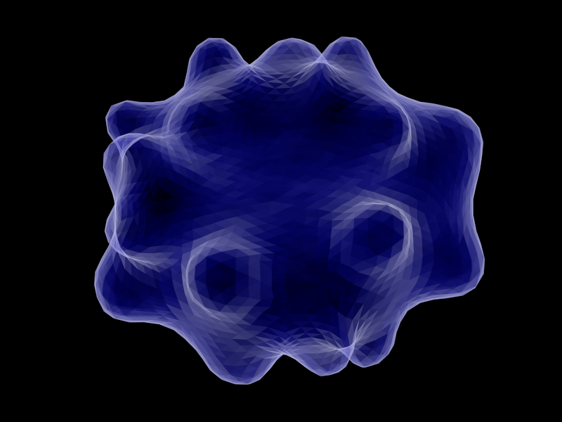

# Intro


A C library for the modelling of triangulated surfaces shaped by forces
and constraints.

# Install

Minimal requirements `pkg-config`, `make`, `gcc-c`. Optional
requrements `gsl`, `geomview`, `atest`, `maxima`.

Download code from
```
$ git clone git@gitlab.ethz.ch:mavt-cse/he
```

Adjust `conf.mk` if you want to change defaults

```
CC = c99
CFLAGS = -O2 -g
PREFIX = $(HOME)
MAXIMA_HOME = $(HOME)/.maxima
```

Library is installed under the path `PREFIX`. Add `PREFIX/bin` and
`PREFIX/man` to envariament variables `PATH` and `MANPATH`. Run
`make`.

Run
```
$ make
```

If you have `atest` installed you can run
```
$ make test
```

# Examples

### hello world

A simple example is in [example/hello](example/hello/)

```
$ cat main.c
#include <stdio.h>

#include <real.h>
#include <he/tri.h>

#define FMT HE_REAL_OUT

int main(void) {
    enum {X, Y, Z};
    real a[3], b[3], c[3], A;

    a[X] = 0; a[Y] = 0; a[Z] = 0;
    b[X] = 1; b[Y] = 0; b[Z] = 0;
    c[X] = 0; c[Y] = 1; c[Z] = 0;

    A = tri_area(a, b, c);
    printf("Area is " FMT "\n", A);
}

```

```
$ cat Makefile
include ../../conf.mk
PREC = d
HE_CFLAGS = `he.conf --cflags $(PREC)`
HE_LDFLAGS = `he.conf --libs $(PREC)`

main: main.c
	$(CC) main.c $(CFLAGS) $(HE_CFLAGS) $(LDFLAGS) $(HE_LDFLAGS) -o main
test:
install:

.PHONY: clean test install doc
clean:; rm -f main

```

### read off file

An example is in [example/off/read](example/off/read/)

```
$ cat main.c
#include <stdio.h>
#include <stdlib.h>

#include <real.h>
#include <he/array.h>
#include <he/he.h>
#include <he/y.h>

#define FMT HE_REAL_OUT

int main(void) {
    real *x, *y, *z;
    real hi, lo;
    He *he;
    int nv;

    y_inif(stdin, &he, &x, &y, &z);
    nv = he_nv(he);
    hi = array_max(nv, x);
    lo = array_min(nv, x);

    printf("number of vertices is %d\n", nv);
    printf(FMT " " FMT "\n", hi, lo);
    y_fin(he, x, y, z);
}

```

# visualization

We use a wrapper to [geomview](https://www.google.com).

```
$ he.geomview -h
he.geomview [-t x y z] [-r x y z] [-a APPEARANCE] [-o FILE] [OFF]..
he geomview wrapper
-t x y z      translation
-r x y z      rotation in degree
-f zoom       field of view (default is 40)
-a APPEARANCE load appearance from a file
-o FILE       write FILE and exit
-O            write all PPM files and exit
-OO           write all oogl files and exit
-format	ppmscreen|ppm|ps|ppmosmesa|ppmosglx
-p command    process every off file by running 'command' < IN.off > OUT.off
-n none|each|all|keep normalization status (see geomview manual)
-c command    run command on every file and write output to stderr, %f is replaced by a file name
-i command    run command on every image, %i replaced by input; %o -- by output; %b --- by basename

Keys:
    q: quit
    s: save snap.ppm
    S: save every snapshot
    p: panel
    j/k: switch between off files
    J: dump file name
    [SPC]: dump orientation and field of view

Environment variables:
WX, WY: resolution of the snapshot (default: 800x600)
BACKGROUND: default ('1 1 1')

Examples:
he.geomview -t 0.25 0.25 0     data/rbc.off
he.geomview -a data/appearance data/rbc.off
he.geomview -o snap.ppm        data/rbc.off
he.geomview                    data/rbc.off data/sph.off
he.geomview -p he.orient       data/rbc.off data/sph.off
he.geomview -c off.volume      data/rbc.off data/sph.off

```

# Lib

## Precision

[prec/d/real.h](lib/prec/d/real.h)
:   double

prec/s/real.h
:   single

prec/l/real.h
:   long double

## Math

edg.h, dedg.h
:   edges and derivatives

tri.h, dtri.h
:   triangles and derivatives

ten.h
:   tensor

vec.h, dvec.h
:   vectors and derivatives

## Utility

array.h
:   array related functions

err.h
:   error handling

macro.h
:   macros

memory.h
:   memory related

util.h
:   uncategorazed

## Surface properties

area.h
:   area

volume.h
:   volume

laplace.h
:   Laplace operator of coordinates

normal.h
:   normal

## Surface transformation

equiangulate.h
:   equlatirate triangles

orient.h
:   orient surface in a direction of eigen values of momentum tensor

## Half-edg related

read.h
:   read half-edg to intermediate structure HeRead, used to initialize
	**he.h**

he.h
:   main half edg data structure (provides half-edg API)

hash.h
:   stores `v` for a pair of `(i, j)`, `i` must be in `[0, n)` API:
	`int i, j, k;` `ini(n); v ` set(i, j); get(i,j)= `get(i,j)` return
	-1 if `(i,j)` was not set

## IO

off.h
:   read OFF

punto.h
:   read/write "punto" files

vtk.h
:   write vtk file

gts.h
:   write gts files

ply.h
:   read/write ply files

obj.h
:   read/write obj files

## X and Y

x.h
:   simple interface for one surface

y.h
:   not so simple interface
